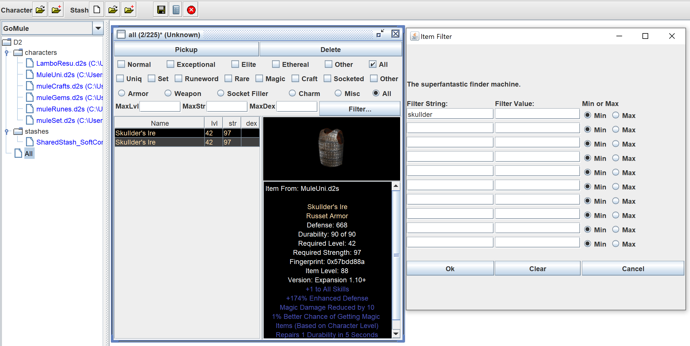
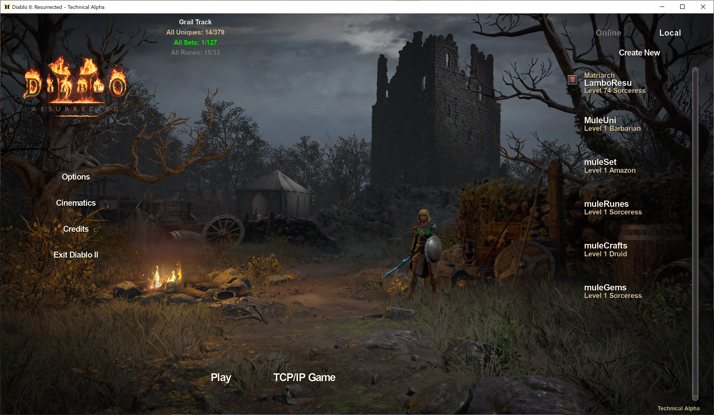

## Gomule-d2r 
GoMule enabled for D2R

### Original GoMule App
http://gomule.sourceforge.net/ all credits go to Gohanman, Randall, Silospen, collaborators, ...

Original usage docs: https://managedway.dl.sourceforge.net/project/gomule/gomule/R0.31/GoMuleDocs.pdf

### Install
1. Install Java Runtime Environment [JRE (Windows x64 exe)](https://javadl.oracle.com/webapps/download/AutoDL?BundleId=244584_d7fc238d0cbf4b0dac67be84580cfb4b) following the [instructions here](https://www.ics.uci.edu/~pattis/common/handouts/pythoneclipsejava/java.html) or [here for setting environment variables](https://www.poftut.com/how-to-set-java-jre-and-jdk-home-path-and-environment-variables-on-windows/)
2. Download the latest [release zip](https://github.com/pairofdocs/gomule-d2r/releases/latest) and unzip it to a convenient location
3. Double click the app at `gomule-d2r-version/gomule/GoMule.jar`
- Alara Shade made this useful video on the installation and usage of the LoD version of GoMule https://youtu.be/ZyRUlZhZU0E?t=55

### Pics
- *Main Char*  

- *Gems moved to the gems mule, runes to the runes mule and uniques to the uniques mule*  

- *Moving&#160;multiple&#160;items*  

- *Searching for items using the All stash filter*  

### Test Save Files
- [Sorc](./savefiles/LamboResu.d2s), [mule](./savefiles/testtt.d2s), [shared stash](./savefiles/SharedStash_SoftCore.d2i)

### Flavie Grail Report
- [Full report](https://pairofdocs.github.io/gomule-d2r/GoMuleReport.html)

- Report Summary  
 

- [Report Summary Json](./gomule/GoMuleSummary.json)

- [Grail Tracking In-Game](https://github.com/pairofdocs/gomule-d2r/releases/tag/v0.12)  

### Fixed/Changed
- Moving items between chars ([pic](https://github.com/pairofdocs/gomule-d2r/pull/1#issuecomment-846635551))
- Annihilus and Torch charms inventory graphics fixed
- Reading + writing a shared stash .d2i file ([pic](https://github.com/pairofdocs/gomule-d2r/pull/2#issuecomment-849347933))
- Changed from original gomule: stash is moved to the left hand side and char + inventory to the right hand side, consistent with how it appears in-game
- Changed from original gomule: an item icon now appears for a selected row in the stash view ([pic](./img/gomule_allitems_search.png))
- Merc item reading and moving
- Add grail stats to D2R's main menu panel json so stats appear in-game ([details here](https://github.com/pairofdocs/gomule-d2r/releases/tag/v0.12))
- Reading a character corpse when the savefile has one
- Displaying tooltips for corpse items
- Add keyboard shortcuts for save-all (ctrl+s) and open-character-file (ctrl+o)
- Drop Calculator bug fixes (Colab with etale#9303 on discord) for super uniques [details on diabloii.net](https://www.diabloii.net/forums/threads/how-the-1-10-pindleskin-nerf-failed-and-snapchip-suffered.965773/)

### Backup Save Files
WARNING: Back up important save files when using GoMule!

GoMule automatically creates backup directories in `GoMule.backup/` each `week` by default.
This can be changed to each `day`, `month` or `never`. 
Click on Preferences when the app is open to change this setting.

### Building and Developing
- To build the GoMule app install JDK (either Java SE 11 (LTS) or Java SE 16) from [here](https://www.oracle.com/java/technologies/javase-downloads.html).
- Install [ant](https://mirrors.gigenet.com/apache//ant/binaries/apache-ant-1.10.10-bin.zip) from [here](https://ant.apache.org/bindownload.cgi) following the [instructions](https://ant.apache.org/manual/install.html). Go through the `Setup` section and set up `ANT_HOME`, `JAVA_HOME` and add `ANT_HOME/bin` to your path
- In a terminal go to the directory  `gomule-d2r/gomule/` and run `ant Jar-BuildAllOptimezed`. This builds GoMule.jar
- Debugging with breakpoints using an IDE also lets you test the app (but doesn't create the java archive GoMule.jar)

### Credits
- http://gomule.sourceforge.net/ for the original app
- https://github.com/d07RiV/d07riv.github.io for the save file converter and cracking the item Huffman encoding
- https://github.com/dschu012/d2s for the save file converter and editor
- https://user.xmission.com/~trevin/DiabloIIv1.09_File_Format.shtml for extensive details on the d2s file format

### Copyrights
Diablo II and Diablo II: Resurrected are [copyrighted](https://www.blizzard.com/en-us/legal/9c9cb70b-d1ed-4e17-998a-16c6df46be7b/copyright-notices) by Blizzard Entertainment, Inc. All rights reserved. Diablo II, Diablo II: Resurrected and Blizzard Entertainment are [trademarks](https://www.blizzard.com/en-us/legal/9c9cb70b-d1ed-4e17-998a-16c6df46be7b/copyright-notices) or registered trademarks of Blizzard Entertainment, Inc. in the U.S. and/or other countries.  
All trademarks referenced here are the properties of their respective owners.

[Note](https://github.com/pairofdocs/gomule-d2r/blob/main/gomule/LICENSE.txt): For the sake of convenience some text files and dc6 image files that gomule requires are provided in the resources directory.
These files are part of the Diablo II game series and are copyrighted by Blizzard Entertainment.
They are provided only to save you the trouble of extracting them from the Diablo II game files.
If you did not purchase a copy of Diablo II and Diablo II: Resurrected be advised that you may not have perimission to use these files.

This project and its maintainers are not associated with or endorsed by Blizzard Entertainment, Inc. 
