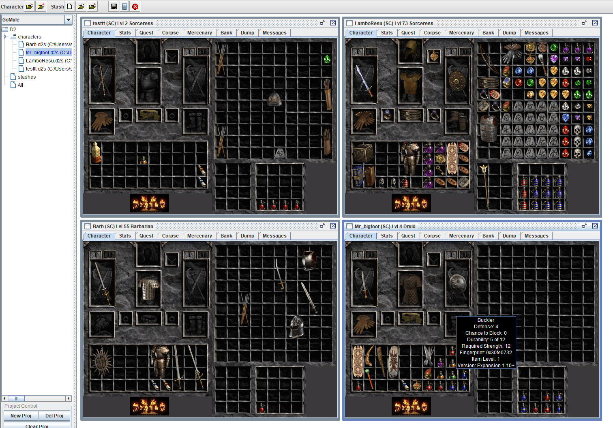

## Gomule-d2r
GoMule enabled for D2R

#### Original GoMule App
http://gomule.sourceforge.net/ all credits go to Gohanman, Randall, Silospen, collaborators, ...

Original usage docs: https://managedway.dl.sourceforge.net/project/gomule/gomule/R0.31/GoMuleDocs.pdf

#### Usage
1. Install Java Runtime Environment [JRE (Windows x64 exe)](https://www.oracle.com/java/technologies/javase-jre8-downloads.html#license-lightbox) and [instructions](https://docs.oracle.com/goldengate/1212/gg-winux/GDRAD/java.htm#BGBFJHAB)
2. Download [GoMule.jar](https://github.com/pairofdocs/gomule-d2r/releases)
3. Double click GoMule.jar

#### Pics
- 

- 

#### Test Save Files
- [Sorc](./savefiles/LamboResu.d2s)

#### Flavie Grail Report
- [Full report](./GoMuleReport.html)

- Report Summary 
-  

#### In Progress, Debugging
- Moving Items around. Currently Moving items from char to char can be done with D2R's in-game shared stash

#### Building and Developing
- To build the GoMule app install JDK (either Java SE 11 (LTS) or Java SE 16) from [here](https://www.oracle.com/java/technologies/javase-downloads.html).
- Install [ant](https://mirrors.gigenet.com/apache//ant/binaries/apache-ant-1.10.10-bin.zip) from [here](https://ant.apache.org/bindownload.cgi) following the [instructions](https://ant.apache.org/manual/install.html). Go through the `Setup` section and set up `ANT_HOME`, `JAVA_HOME` and add `ANT_HOME/bin` to your path
- In a terminal go to the directory  `gomule-d2r/gomule/` and run `ant Jar-BuildAllOptimezed`. This builds GoMule.jar
- Debuggin with breakpoints using an IDE also lets you test the app (but doesn't create the java archive GoMule.jar)

#### Credits
- http://gomule.sourceforge.net/ for the original app
- https://github.com/d07RiV/d07riv.github.io for the save file converter and cracking the item Huffman encoding
- https://github.com/dschu012/d2s for the save file converter and editor
